# From Grids to GPT

<p align="center">
  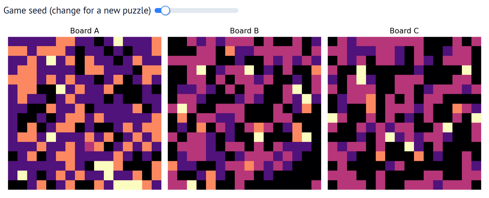
</p>

**An Interactive Re-implementation of _Training Language Models via Neural Cellular Automata_**

This repository provides a visually rich, notebook-driven exploration of Neural Cellular Automata (NCA) for synthetic token generation and pretraining. Below you'll find a compact summary, quick links, and a curated gallery of the figures used in the project.

---

## Live Notebook

Open the live interactive notebook in molab:

> **[Open in molab →](https://molab.marimo.io/notebooks/nb_oXEVG98GdYfmRxmKupEDuD)**

---

## Quick Highlights

- 164M NCA-generated tokens match or exceed performance of 1.6B natural tokens on reasoning benchmarks.
- Interactive NCA playground with sliders and live re-runs.
- Statistical analyses: Zipf checks, spectral (1/f) analysis, state-transition heatmaps, entropy evolution.
- Complexity sweep dashboard and NCA zoo for exploring high-quality rules.

---

## Gallery — Figures (click to enlarge)

Below are the images used in the notebook and README. Files live in `images/`.

### 01 — NCA grid evolution (animated)
<p align="center">
  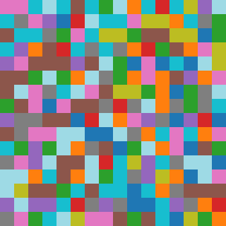
</p>

### 02 — Spacetime diagram
<p align="center">
  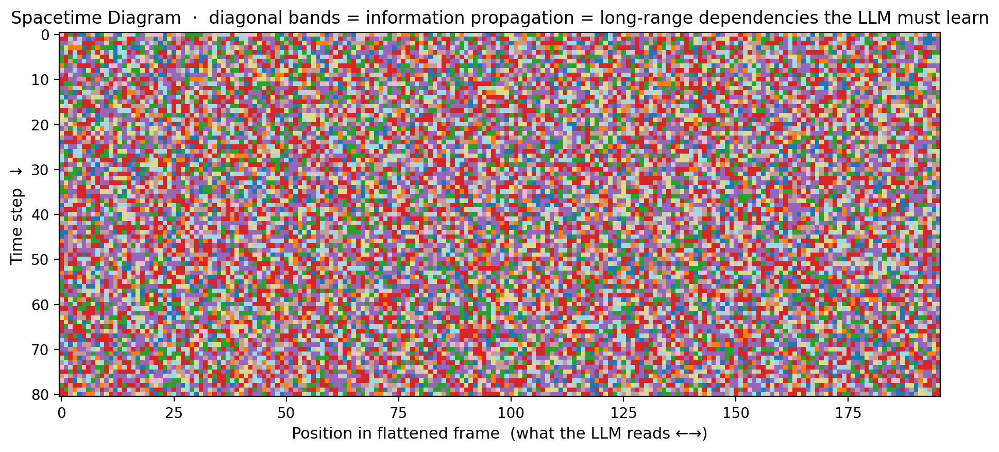
</p>

### 03 — Token frequency (Zipf) and histogram
<p align="center">
  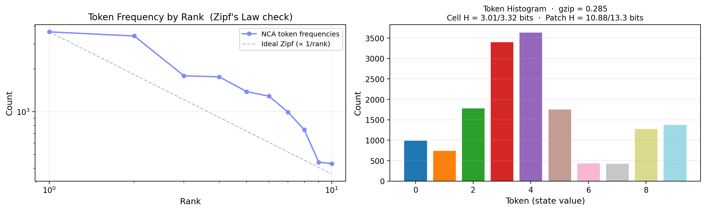
</p>

### 04 — State transition heatmap
<p align="center">
  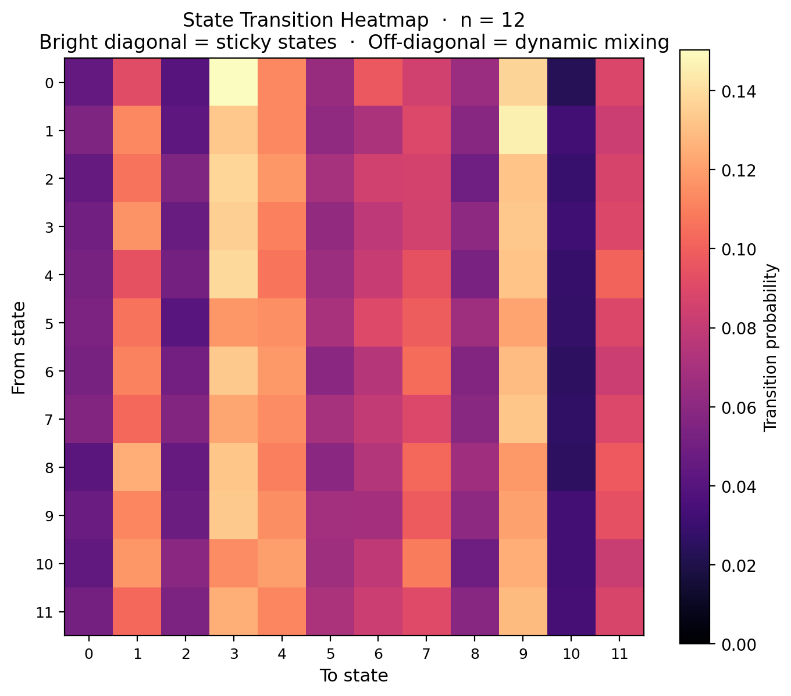
</p>

### 05 — Spectral power / 1/f analysis
<p align="center">
  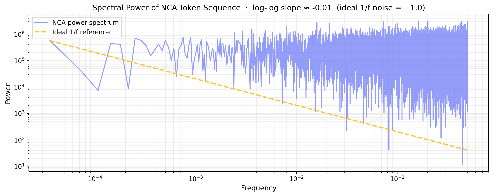
</p>

### 06 — Entropy evolution
<p align="center">
  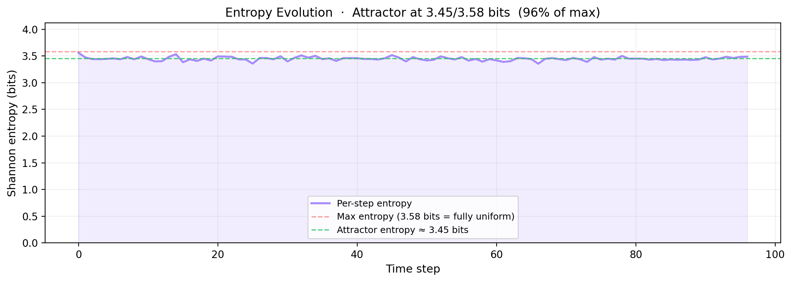
</p>

### 07 — Cell vs 2×2 patch frequency comparison
<p align="center">
  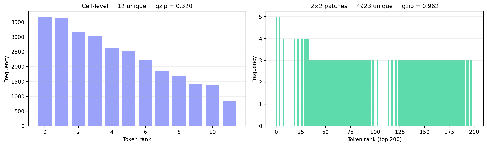
</p>

### 08 — Seed evolution triptych (example steps)
<p align="center">
  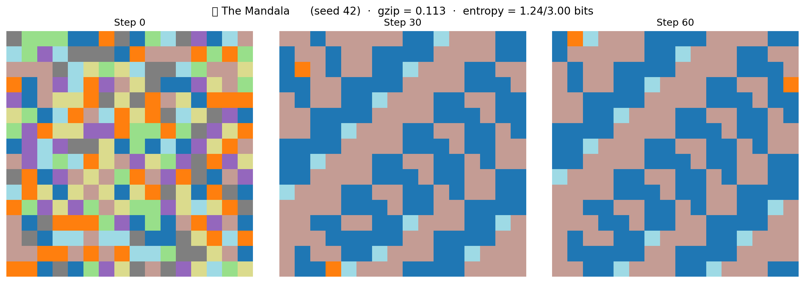
</p>

### 09 — Complexity distribution (violin/box)
<p align="center">
  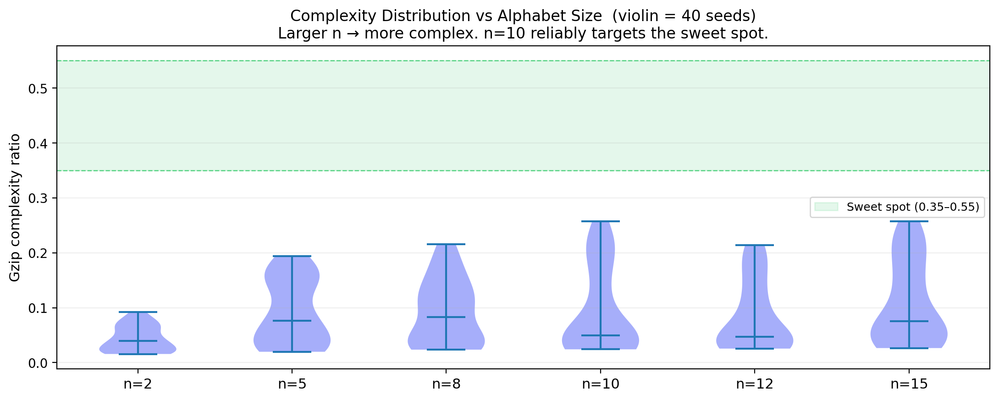
</p>

### 10 — Token efficiency gains schematic
<p align="center">
  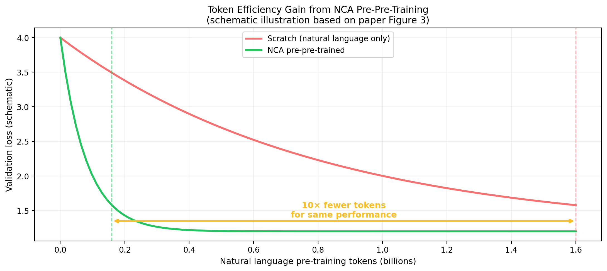
</p>

### 11 — Complexity / diversity vs power-law panel
<p align="center">
  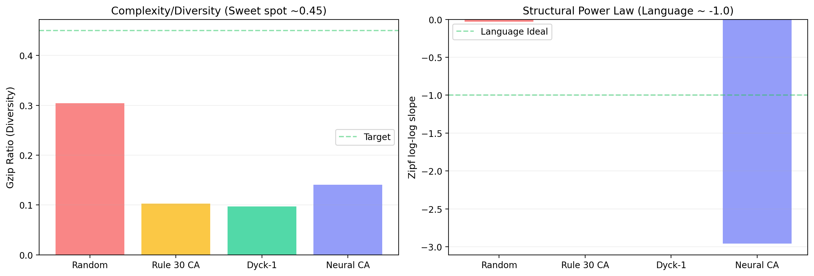
</p>

### 12 — NCA grid snapshot (single step)
<p align="center">
  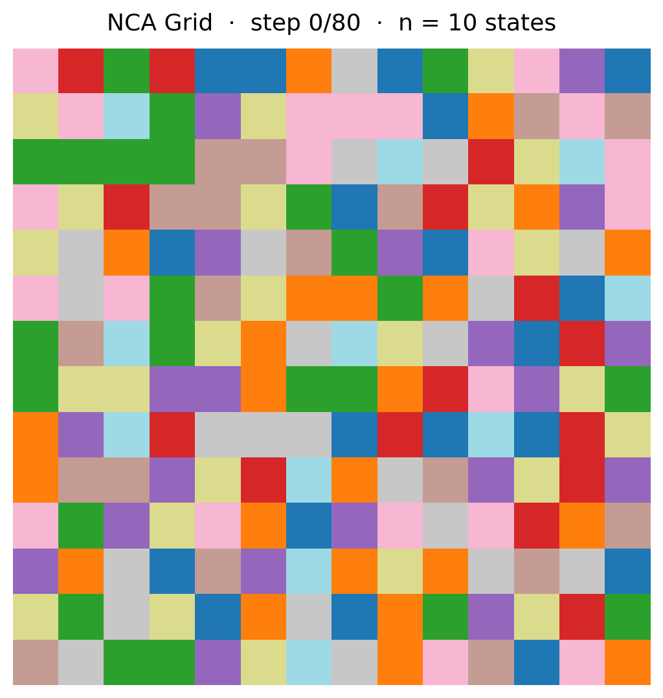
</p>

### 13 — Interactive playground screenshot (hero)
<p align="center">
  
</p>

---

## Getting Started

Clone and run the notebook locally (no GPU required):

```bash
git clone https://github.com/Eishaan-Khatri/NCA-Language-Models.git
cd NCA-Language-Models
pip install marimo numpy matplotlib pillow
marimo edit nca_prepretraining.py
```

## Dependencies

- marimo >= 0.9.0
- numpy
- matplotlib >= 3.5
- pillow

---

## License

This project is released under the MIT License. See LICENSE for details.

---

If you'd like tweaks to the layout (smaller thumbnails, extra captions, or ordering changes), tell me which adjustments you want and I will update the README.
